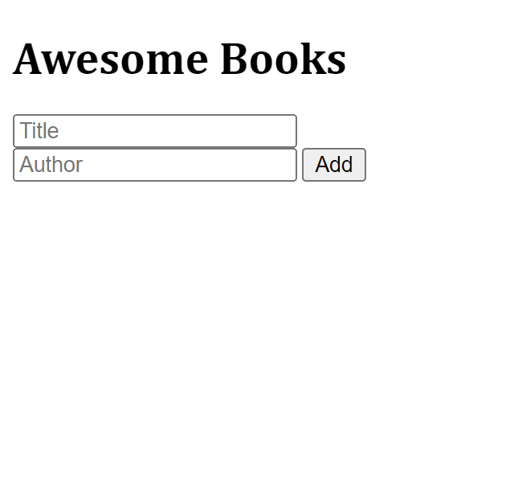

# Portfolio Project

This project contains the Awesome Books Project, coded according to requirements provided by Microverse Inc.

# Project Name

**Awesome Books**

# Screenshot

# Live Website

Click [here](https://dammyshittu.github.io/Awesome-Books/) to view the website online.

# This project was built with:

HTML5

JavaScript

Linters

Website was deployed with Github Pages

# Version Control System

GIT

# Hosting Platform

Github

# 👤 Author

GitHub: [@dammyShittu](https://github.com/DammyShittu/)

Twitter: [@aded_shittu](https://twitter.com/aded_shittu/)

LinkedIn: [Adedamola Shittu](https://linkedin.com/in/adedamola-shittu-3ab465172/)

# 🤝 Contributing

Contributions, issues, and feature requests are welcome!

Feel free to check the issues page.

Show your support

Give a ⭐️ if you like this project!

# 📝 License

This project is MIT licensed.
